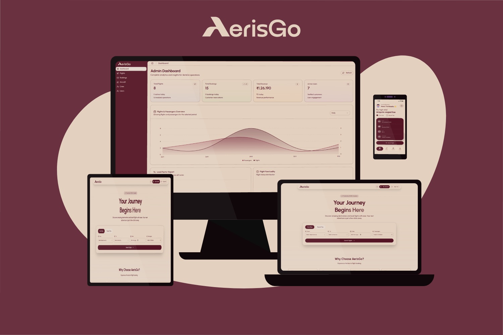

---

## ⚠️ Important Notice (Read Before Cloning)

This repository uses Git submodules to manage different parts of the project.

❌ Do NOT use "Download ZIP"  
❌ Normal git clone will NOT fetch submodules  

### ✅ Correct Way to Clone
```git clone --recurse-submodules https://github.com/maantrambadia/AerisGo.git```

### 🔁 If You Already Cloned the Repository
```git submodule update --init --recursive```

---

## 🛠️ Tech Stack

| Module     | Technology Used                |
|------------|--------------------------------|
| Backend    | Node.js, Express.js, MongoDB   |
| Dashboard  | React.js                       |
| Web        | React.js                       |
| Mobile     | React Native                   |

---

## 📁 Repository Structure

AerisGo/<br>
├── Diagrams/       → Project Diagrams<br> 
├── Documents/      → Project Documents<br>
├── Implementation/ → Project Implementation<br> 
├── Screenshots/    → Project Screenshots

---

## 🔖 Versioning & Releases

- Each module maintains its own releases and tags
- The main repository references specific stable versions of each module
- Ensures modular and clean version control

---

## 👥 Team Contributions

Work was divided by modules, not by equal commit count.

| Module      | Contributor(s)                      |
|-------------|-------------------------------------|
| Backend     | Vansh Lakhani, Maan Trambadia       |
| Dashboard   | Esha Bhadja                         |
| Web         | Parth Joisar                        |
| Mobile      | Aaditya Paneri                      |
| Docs & Test | Vansh Lakhani, Maan Trambadia       |

---

## 🧑‍🏫 Note for Evaluators

This project uses Git submodules to maintain a clean and professional architecture.  
Each module is independently versioned, while this repository serves as the single submission entry point.